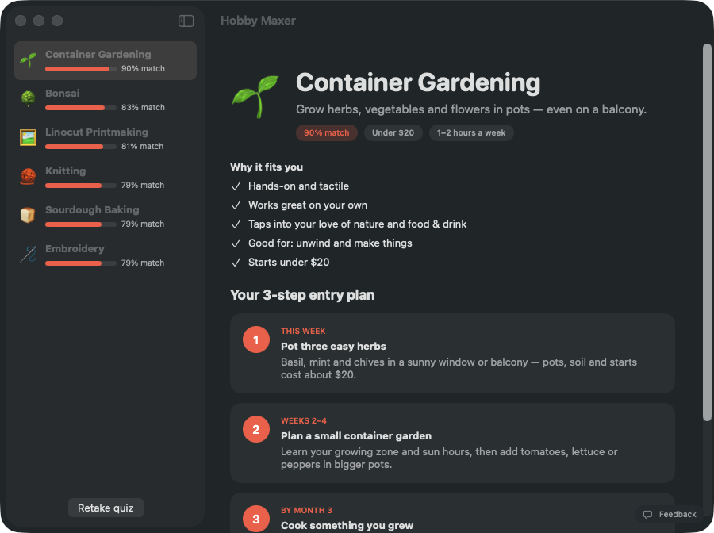
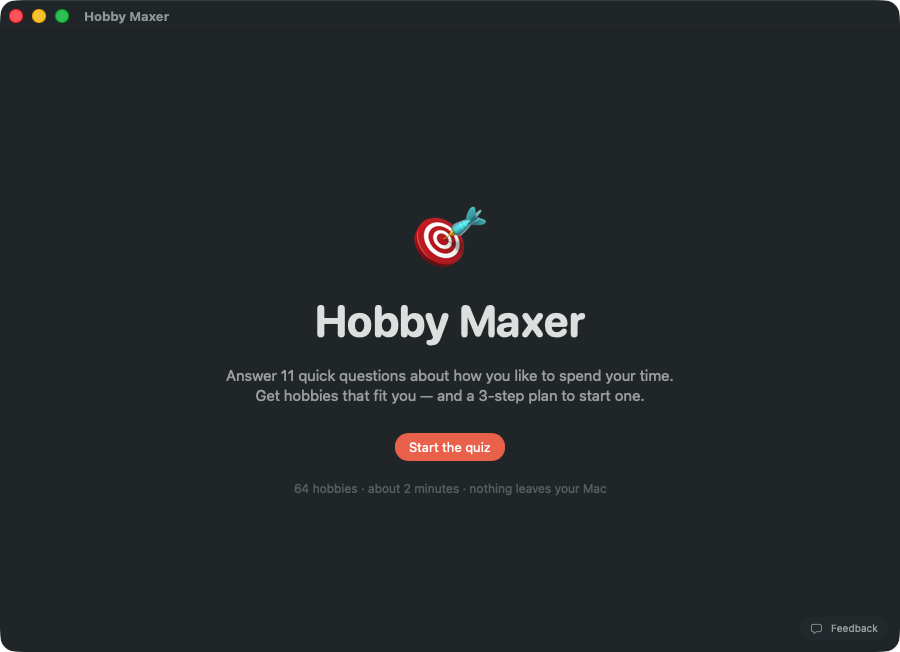
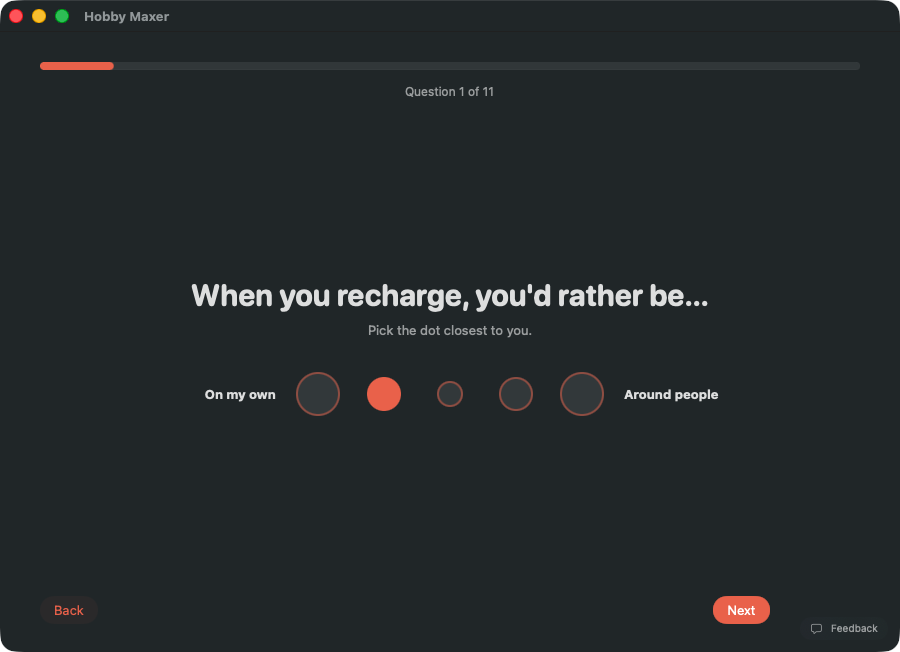
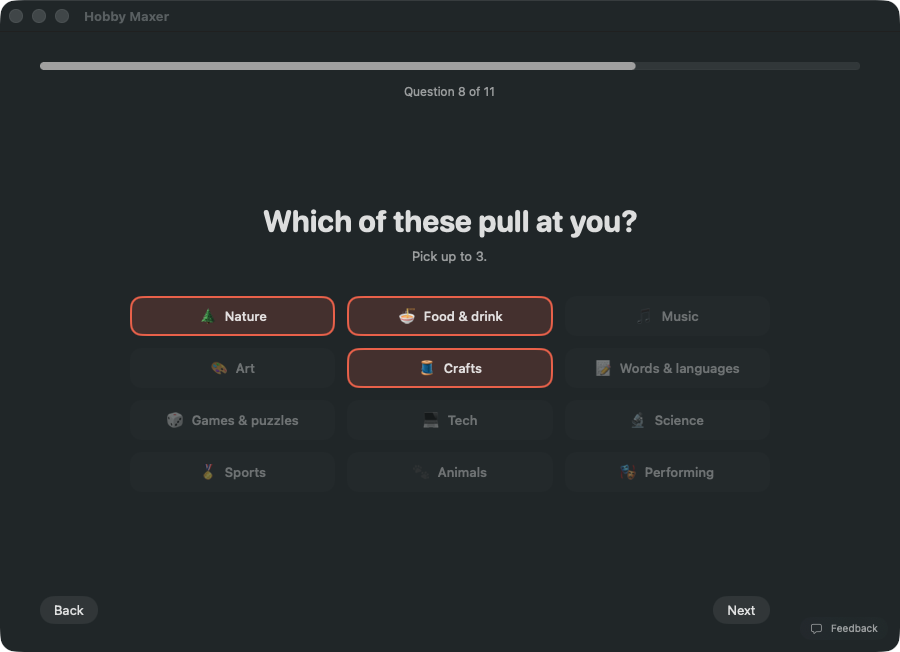
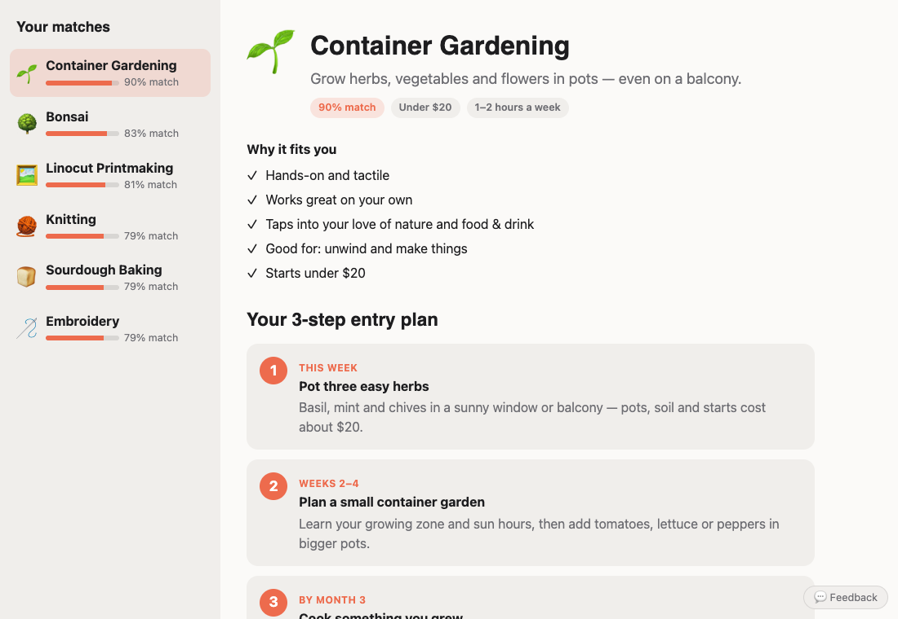
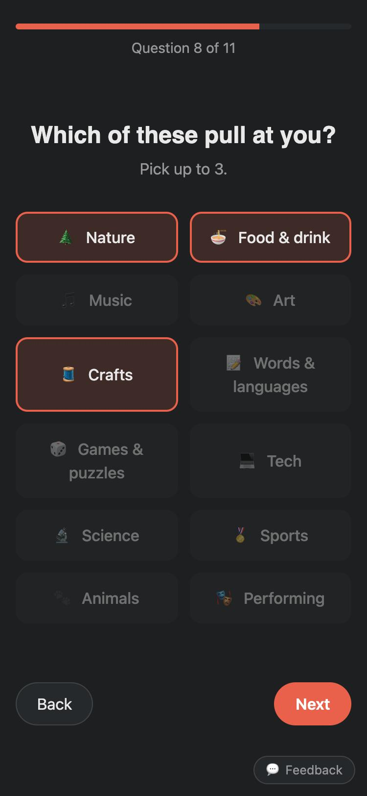
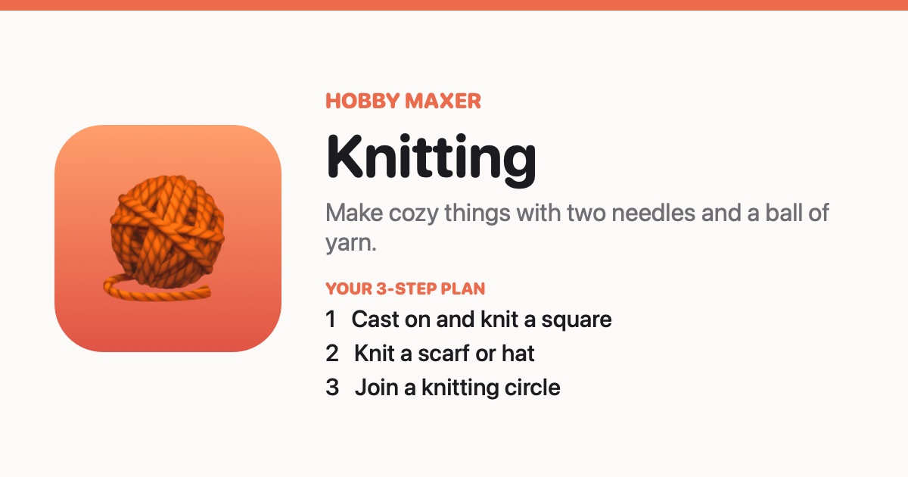
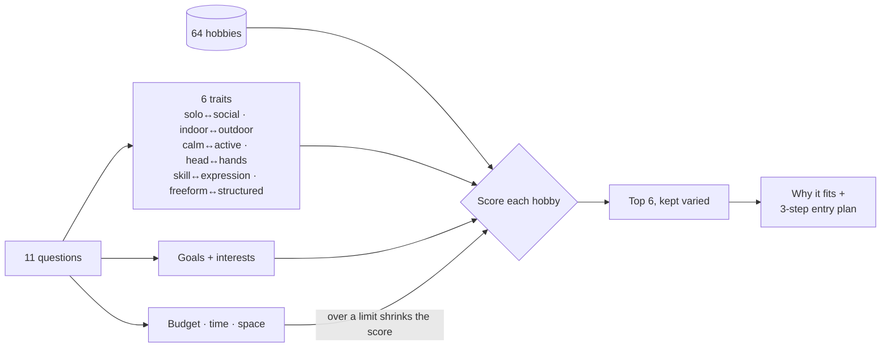

# Hobby Maxer

A Mac app and website that figure out which hobbies fit you — and give you a 3-step plan to start one.

**[Try it on the web →](https://amalmehta.github.io/HobbyMaxer/)**

| Welcome | Quick questions | Pick what pulls at you |
|---|---|---|
|  |  |  |

### On the web

| Desktop | Phone |
|---|---|
|  |  |

Shared links preview like this in Messages, Slack and WhatsApp:

## How it matches

## Links

- [Website](https://amalmehta.github.io/HobbyMaxer/)
- [Instructions](docs/INSTRUCTIONS.md) — set up, run and use
- [File Structure](docs/FILE-STRUCTURE.md) — what's where
