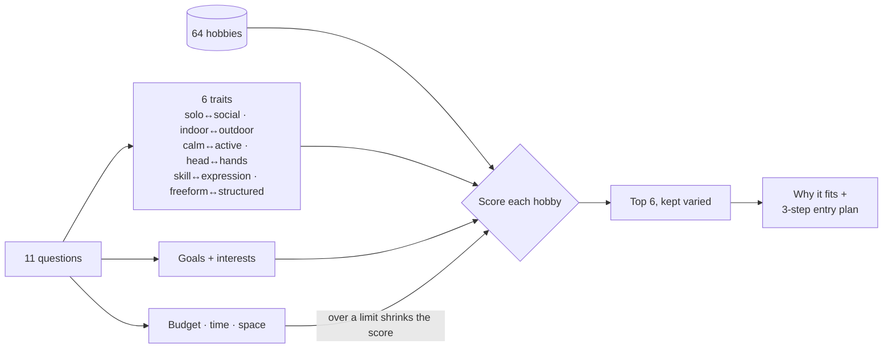

# Hobby Maxer

A Mac app that figures out which hobbies fit you — and gives you a 3-step plan to start one.

| Welcome | Quick questions | Pick what pulls at you |
|---|---|---|
|  |  |  |

## How it matches

## Links

- [Instructions](docs/INSTRUCTIONS.md) — set up, run and use
- [File Structure](docs/FILE-STRUCTURE.md) — what's where
